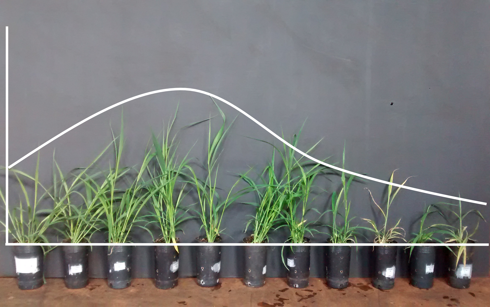
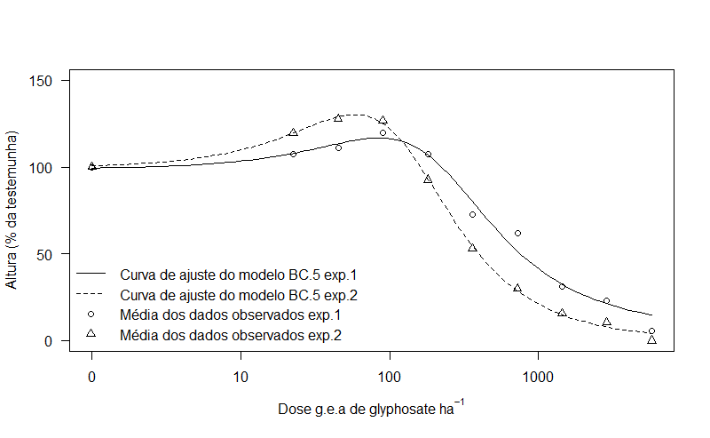
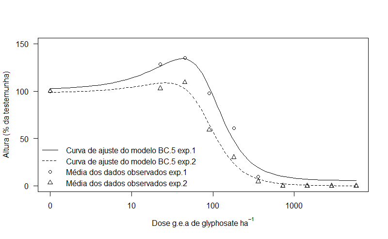
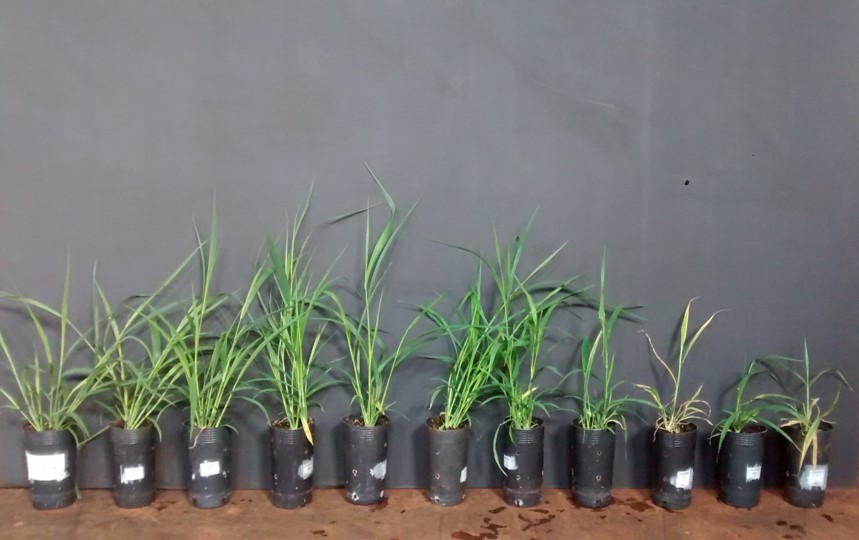
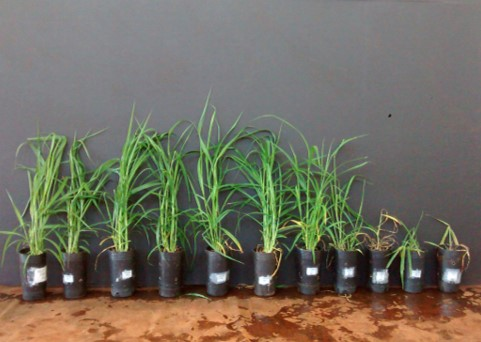
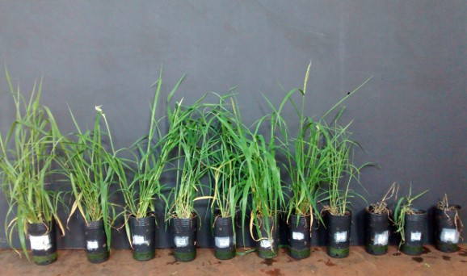
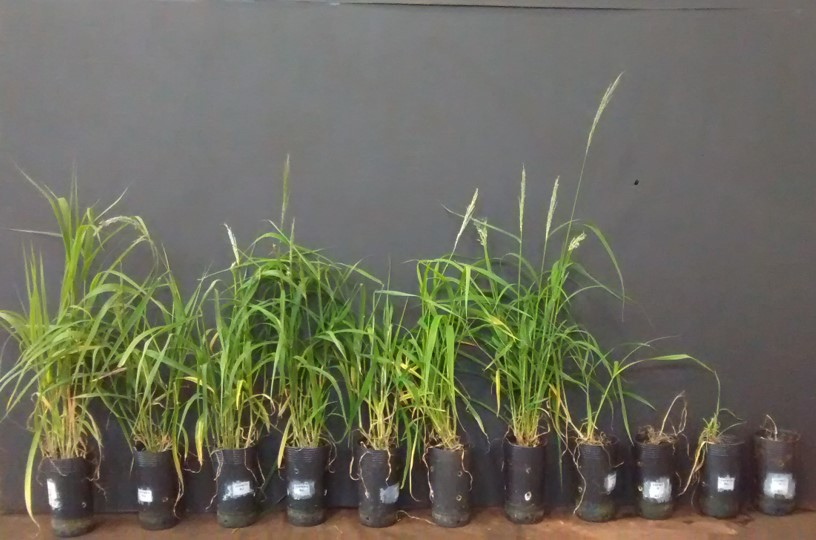
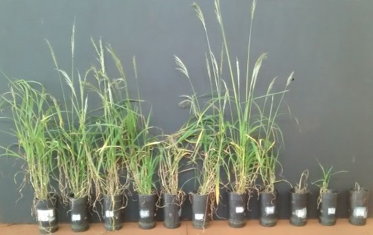

```{r xaringan-themer, include = FALSE}
library(xaringanthemer)
mono_accent(base_color = "#4FAE52")
```
.pull-left[
##Vitor Muller Anunciato##

🎓

PhD candidate in Crop Protection (Weedscience), [UNESP](https://www.fca.unesp.br/#!/international/eng/), current.

Msc in Crop Protection (Weedscience), [UNESP](https://www.fca.unesp.br/#!/international/eng/), 2018.

BSc in Agronomy, [UEL](http://www.uel.br/portal/en/pages/en.php?lang=PT), 2016.


📧 

vitor.muller@gmail.com
[@vitor_anunciato](https://twitter.com/vitor_anunciato)
[serialweedkiller.com](https://serialweedkiller.netlify.com/)

]

.pull-right[
##Summary##

- What is hormesis?

- Thesis objective

- My hypotesis

- Material and Methods

- Key results

- Conclusion
]
---
#What is hormesis?#
.pull-left[
"All things are poison and nothing (is) without poison; only the dose makes that a thing is no poison."

*Paracelsus (1493-1541)*
]
--
.pull-right[
]
---
#What is a posion?#
```{r echo=FALSE, out.width="100%"}
knitr::include_graphics("img/dl-adapted.png")
```
Source: adapted from [sciencematters.com](https://sciencemattersca.com/about/science-101/)
---
class:inverse
###Normal dose response glyphosate vs. susceptible *D.insularis* ###
```{r echo=FALSE, out.width="150%"}
knitr::include_graphics("img/drc.png")
```

.pull-left[0 g ea ha-¹] 
.right[64000 g ea ha-¹]
---
class:inverse
###Glyphosate in growth stimulus in *D.insularis* ###
```{r echo=FALSE, out.width="150%"}

```

.pull-left[0 g ea ha-¹] 
.right[720 g ea ha-¹]
---
#Thesis objective#

Evaluate the effect of glyphosate herbicide in the growth of * Digitaria insularis.*

--

#My hypotesis#
H0: glyphosate can't stimulate the growth of *Digitaria insularis*
H1: glyphosate can stimulate the growth of *Digitaria insularis*

---
#Material and methods#
$$f(x) = c + \frac{d-c}{1+\exp(b(\log(x)-\log(e)))}$$

Source: Seber, G. A. F. and Wild, C. J (1989) Nonlinear Regression, New York: Wiley & Sons (p. 330).


$$f(x) = c + \frac{d-c+fx}{1+\exp(b(\log(x)-\log(e)))}$$

Source: Brain, P. and Cousens, R. (1989) An equation to describe dose responses where there is stimulation of growth at low doses, Weed Research, 29, 93--96. 
---
##Model adjustment##
```{r library, include=FALSE, results="hide"}
library(drc)
```

```{r}
lettuce.m1 <- drm(lettuce[,c(2,1)], fct=BC.5())
lettuce.m2 <- drm(lettuce[,c(2,1)], fct=LL.4())
```
.pull-left[
```{r}
plot(lettuce.m1)
```
]
.pull-right[
```{r}
plot(lettuce.m2)
```
]
---
## Model parameters BC.5 ##
```{r}
summary(lettuce.m1)
```
---
## Model parameters LL.4 ##
```{r}
summary(lettuce.m2)
```
---
## Model compairason BC.5 vs LL.4 ##
```{r}
anova(lettuce.m1, lettuce.m2)
```
---
#Results#
```{r echo=FALSE, out.width="150%"}

```
---
#Results#
```{r echo=FALSE, out.width="150%"}

```
---
#7 DAA#
```{r echo=FALSE, out.width="150%"}

```
---
#15 DAA#
```{r echo=FALSE, out.width="150%"}

```
---
#21 DAA#
```{r echo=FALSE, out.width="150%"}

```
---
#28 DAA#
```{r echo=FALSE, out.width="150%"}

```
---
#41 DAA#
```{r echo=FALSE, out.width="150%"}

```
---
#48 DAA#
```{r echo=FALSE, out.width="150%"}
knitr::include_graphics("img/hormesis48DAA.jpg")
```
---
class:inverse
#Conclusion#
Glyphosate can stimulate the growth of the *Digitaria insularis* up to 60%.
.right[*Thank you*]

